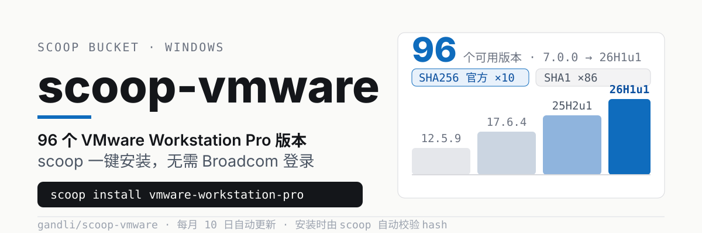
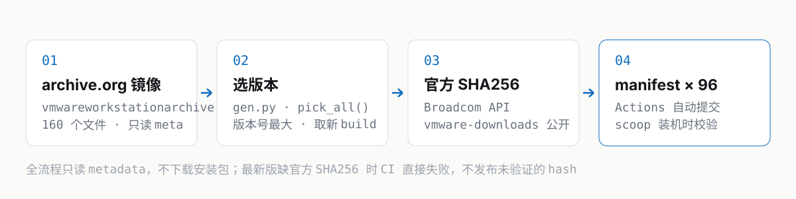

# scoop-vmware

用 [Scoop](https://scoop.sh/) 在 Windows 上一键安装任意版本的 VMware Workstation Pro，**免 Broadcom 登录，安装时自动校验 hash**。

<p align="center">
  
</p>

## 安装

```powershell
scoop bucket add vmware https://github.com/gandli/scoop-vmware
scoop install vmware-workstation-pro            # 最新版 26H1u1
scoop install vmware-workstation-pro-17.6.4      # 指定历史版本
scoop search vmware-workstation-pro              # 列全部 96 个版本
scoop uninstall vmware-workstation-pro
```

一条命令就装完，不需要 Broadcom Support Portal 账号，也不需要下载页面上找安装包。

## 它是什么

一个 [Scoop](https://scoop.sh/) bucket，把 archive.org 上镜像的 VMware Workstation Pro 整理成 scoop manifest：

- **96 个版本**：`7.0.0` → `26H1u1`，一个版本一个 manifest，文件名就是 `-<版本号>`
- **`bucket/*.json` + `gen.py`**：manifest 全部由脚本从 archive.org 元数据生成，不手写
- **每月自动更新**：GitHub Actions 定时跑 `gen.py`，有变化才提交
- **装机时校验**：manifest 里的 hash 由 scoop 在安装前校验，对不上直接中止

## 数据从哪来

<p align="center">
  
</p>

唯一数据源是 archive.org collection [`vmwareworkstationarchive`](https://archive.org/details/vmwareworkstationarchive)：

```bash
curl -s https://archive.org/metadata/vmwareworkstationarchive | python -m json.tool | head
```

`gen.py` 从这份元数据里挑版本号最大的 `.exe`（`26H1u1` > `26H1` > `25H2u1` > … > `17.6.4` > … > `7.0.0`，同版本取更大的 build），生成对应 manifest。**全程只读元数据，不下载安装包**，跑完约 2 秒。

### hash 用的是哪一层

| hash | 覆盖版本 | 来源 |
|:-----|:---------|:-----|
| **SHA256** | 10 个（`25H2*` / `26H1*` / `17.5.2`~`17.6.4`） | Broadcom 官方 API，经 [gandli/vmware-downloads](https://github.com/gandli/vmware-downloads) 公开，且已与 archive.org 侧 MD5 交叉比对 |
| SHA1 | 86 个历史版本 | archive.org 自带值。官方校验表只覆盖还在 Portal 上架的版本 |

CI 跑的是 `--strict`：**最新版拿不到官方 SHA256 就直接失败**，不会把 archive.org 的 SHA1 当成已验证结果发布出去。历史版本不受此约束（官方本就只覆盖在架版本），否则 CI 永远红。

想自己复核：`scoop hash <下载下来的 exe>`，输出直接跟 manifest 的 `hash` 字段比。

## 自动更新

`.github/workflows/update.yml` 每月 10 日 UTC 04:17 自动跑 `gen.py`，有 diff 才提交（也支持手动 `workflow_dispatch`）。Broadcom 发布新版本后通常 1~2 天内跟进。

## 版本清单

由 `gen.py` 从 manifest 自动生成，勿手改。

<details>
<summary>展开全部 96 个版本（96 行表格，收起不影响阅读）</summary>

<!-- versions:start -->

96 个版本，新版在上：

| 版本 | 安装 | hash |
|:----|:-----|:-----|
| 26H1u1 | `scoop install vmware-workstation-pro` | SHA256（官方） |
| 26H1 | `scoop install vmware-workstation-pro-26H1` | SHA256（官方） |
| 25H2u1 | `scoop install vmware-workstation-pro-25H2u1` | SHA256（官方） |
| 25H2 | `scoop install vmware-workstation-pro-25H2` | SHA256（官方） |
| 17.6.4 | `scoop install vmware-workstation-pro-17.6.4` | SHA256（官方） |
| 17.6.3 | `scoop install vmware-workstation-pro-17.6.3` | SHA256（官方） |
| 17.6.2 | `scoop install vmware-workstation-pro-17.6.2` | SHA256（官方） |
| 17.6.1 | `scoop install vmware-workstation-pro-17.6.1` | SHA256（官方） |
| 17.6.0 | `scoop install vmware-workstation-pro-17.6.0` | SHA256（官方） |
| 17.5.2 | `scoop install vmware-workstation-pro-17.5.2` | SHA256（官方） |
| 17.5.1 | `scoop install vmware-workstation-pro-17.5.1` | SHA1 |
| 17.5.0 | `scoop install vmware-workstation-pro-17.5.0` | SHA1 |
| 17.0.2 | `scoop install vmware-workstation-pro-17.0.2` | SHA1 |
| 17.0.1 | `scoop install vmware-workstation-pro-17.0.1` | SHA1 |
| 17.0.0 | `scoop install vmware-workstation-pro-17.0.0` | SHA1 |
| 16.2.5 | `scoop install vmware-workstation-pro-16.2.5` | SHA1 |
| 16.2.4 | `scoop install vmware-workstation-pro-16.2.4` | SHA1 |
| 16.2.3 | `scoop install vmware-workstation-pro-16.2.3` | SHA1 |
| 16.2.2 | `scoop install vmware-workstation-pro-16.2.2` | SHA1 |
| 16.2.1 | `scoop install vmware-workstation-pro-16.2.1` | SHA1 |
| 16.2.0 | `scoop install vmware-workstation-pro-16.2.0` | SHA1 |
| 16.1.2 | `scoop install vmware-workstation-pro-16.1.2` | SHA1 |
| 16.1.1 | `scoop install vmware-workstation-pro-16.1.1` | SHA1 |
| 16.1.0 | `scoop install vmware-workstation-pro-16.1.0` | SHA1 |
| 16.0.0 | `scoop install vmware-workstation-pro-16.0.0` | SHA1 |
| 15.5.7 | `scoop install vmware-workstation-pro-15.5.7` | SHA1 |
| 15.5.6 | `scoop install vmware-workstation-pro-15.5.6` | SHA1 |
| 15.5.5 | `scoop install vmware-workstation-pro-15.5.5` | SHA1 |
| 15.5.2 | `scoop install vmware-workstation-pro-15.5.2` | SHA1 |
| 15.5.1 | `scoop install vmware-workstation-pro-15.5.1` | SHA1 |
| 15.5.0 | `scoop install vmware-workstation-pro-15.5.0` | SHA1 |
| 15.1.0 | `scoop install vmware-workstation-pro-15.1.0` | SHA1 |
| 15.0.4 | `scoop install vmware-workstation-pro-15.0.4` | SHA1 |
| 15.0.3 | `scoop install vmware-workstation-pro-15.0.3` | SHA1 |
| 15.0.2 | `scoop install vmware-workstation-pro-15.0.2` | SHA1 |
| 15.0.1 | `scoop install vmware-workstation-pro-15.0.1` | SHA1 |
| 15.0.0 | `scoop install vmware-workstation-pro-15.0.0` | SHA1 |
| 14.1.8 | `scoop install vmware-workstation-pro-14.1.8` | SHA1 |
| 14.1.7 | `scoop install vmware-workstation-pro-14.1.7` | SHA1 |
| 14.1.6 | `scoop install vmware-workstation-pro-14.1.6` | SHA1 |
| 14.1.5 | `scoop install vmware-workstation-pro-14.1.5` | SHA1 |
| 14.1.4 | `scoop install vmware-workstation-pro-14.1.4` | SHA1 |
| 14.1.3 | `scoop install vmware-workstation-pro-14.1.3` | SHA1 |
| 14.1.2 | `scoop install vmware-workstation-pro-14.1.2` | SHA1 |
| 14.1.1 | `scoop install vmware-workstation-pro-14.1.1` | SHA1 |
| 14.1.0 | `scoop install vmware-workstation-pro-14.1.0` | SHA1 |
| 14.0.0 | `scoop install vmware-workstation-pro-14.0.0` | SHA1 |
| 12.5.9 | `scoop install vmware-workstation-pro-12.5.9` | SHA1 |
| 12.5.8 | `scoop install vmware-workstation-pro-12.5.8` | SHA1 |
| 12.5.7 | `scoop install vmware-workstation-pro-12.5.7` | SHA1 |
| 12.5.6 | `scoop install vmware-workstation-pro-12.5.6` | SHA1 |
| 12.5.5 | `scoop install vmware-workstation-pro-12.5.5` | SHA1 |
| 12.5.4 | `scoop install vmware-workstation-pro-12.5.4` | SHA1 |
| 12.5.3 | `scoop install vmware-workstation-pro-12.5.3` | SHA1 |
| 12.5.2 | `scoop install vmware-workstation-pro-12.5.2` | SHA1 |
| 12.5.1 | `scoop install vmware-workstation-pro-12.5.1` | SHA1 |
| 12.5.0 | `scoop install vmware-workstation-pro-12.5.0` | SHA1 |
| 12.1.1 | `scoop install vmware-workstation-pro-12.1.1` | SHA1 |
| 12.1.0 | `scoop install vmware-workstation-pro-12.1.0` | SHA1 |
| 12.0.1 | `scoop install vmware-workstation-pro-12.0.1` | SHA1 |
| 12.0.0 | `scoop install vmware-workstation-pro-12.0.0` | SHA1 |
| 11.1.4 | `scoop install vmware-workstation-pro-11.1.4` | SHA1 |
| 11.1.3 | `scoop install vmware-workstation-pro-11.1.3` | SHA1 |
| 11.1.2 | `scoop install vmware-workstation-pro-11.1.2` | SHA1 |
| 11.1.1 | `scoop install vmware-workstation-pro-11.1.1` | SHA1 |
| 11.1.0 | `scoop install vmware-workstation-pro-11.1.0` | SHA1 |
| 11.0.0 | `scoop install vmware-workstation-pro-11.0.0` | SHA1 |
| 10.0.7 | `scoop install vmware-workstation-pro-10.0.7` | SHA1 |
| 10.0.6 | `scoop install vmware-workstation-pro-10.0.6` | SHA1 |
| 10.0.5 | `scoop install vmware-workstation-pro-10.0.5` | SHA1 |
| 10.0.4 | `scoop install vmware-workstation-pro-10.0.4` | SHA1 |
| 10.0.3 | `scoop install vmware-workstation-pro-10.0.3` | SHA1 |
| 10.0.2 | `scoop install vmware-workstation-pro-10.0.2` | SHA1 |
| 10.0.1 | `scoop install vmware-workstation-pro-10.0.1` | SHA1 |
| 10.0.0 | `scoop install vmware-workstation-pro-10.0.0` | SHA1 |
| 9.0.4 | `scoop install vmware-workstation-pro-9.0.4` | SHA1 |
| 9.0.3 | `scoop install vmware-workstation-pro-9.0.3` | SHA1 |
| 9.0.2 | `scoop install vmware-workstation-pro-9.0.2` | SHA1 |
| 9.0.1 | `scoop install vmware-workstation-pro-9.0.1` | SHA1 |
| 9.0.0 | `scoop install vmware-workstation-pro-9.0.0` | SHA1 |
| 8.0.6 | `scoop install vmware-workstation-pro-8.0.6` | SHA1 |
| 8.0.5 | `scoop install vmware-workstation-pro-8.0.5` | SHA1 |
| 8.0.4 | `scoop install vmware-workstation-pro-8.0.4` | SHA1 |
| 8.0.3 | `scoop install vmware-workstation-pro-8.0.3` | SHA1 |
| 8.0.2 | `scoop install vmware-workstation-pro-8.0.2` | SHA1 |
| 8.0.1 | `scoop install vmware-workstation-pro-8.0.1` | SHA1 |
| 8.0.0 | `scoop install vmware-workstation-pro-8.0.0` | SHA1 |
| 7.1.6 | `scoop install vmware-workstation-pro-7.1.6` | SHA1 |
| 7.1.5 | `scoop install vmware-workstation-pro-7.1.5` | SHA1 |
| 7.1.4 | `scoop install vmware-workstation-pro-7.1.4` | SHA1 |
| 7.1.3 | `scoop install vmware-workstation-pro-7.1.3` | SHA1 |
| 7.1.2 | `scoop install vmware-workstation-pro-7.1.2` | SHA1 |
| 7.1.1 | `scoop install vmware-workstation-pro-7.1.1` | SHA1 |
| 7.1.0 | `scoop install vmware-workstation-pro-7.1.0` | SHA1 |
| 7.0.1 | `scoop install vmware-workstation-pro-7.0.1` | SHA1 |
| 7.0.0 | `scoop install vmware-workstation-pro-7.0.0` | SHA1 |

<!-- versions:end -->

</details>

## 注意事项

- **需要管理员权限**：安装脚本用 `Start-Process -Verb RunAs` 触发 UAC 提权，scoop 本身不提权。
- **静默参数**：`/s /v"/qn EULAS_AGREED=1 REBOOT=R"`（InstallShield 包 MSI）。
- **无需序列号**：17.5.2 起 VMware Workstation Pro 对个人与商业用途免费；更早的版本需要序列号。
- **老版本不一定能装**：7.x~16.x 是 2010~2020 年的包，在现代 Windows 上大概率装不上，列出来只为应急与取证。
- **下载源是 archive.org**：`url` 会 302 跳到 `*.ca.archive.org` 节点；网络不通时先给 scoop 配代理。
- **没写 `checkver`**：archive.org 元数据是单行大 JSON，正则抓版本号会命中列表第一项而非最新项，与其给个会误报的提示，不如让 CI 直接更新。

## License

manifest 与脚本：MIT。VMware 安装包本体版权归 Broadcom 所有，受 [Broadcom EULA](https://www.broadcom.com/company/legal/licensing) 约束，本仓库只提供索引。